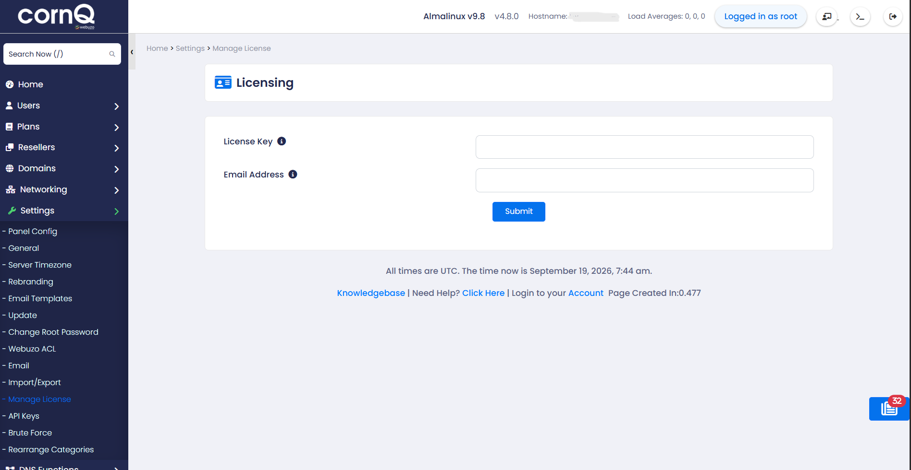
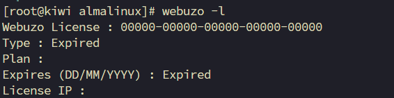
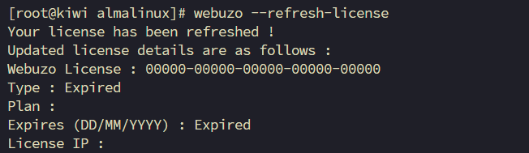
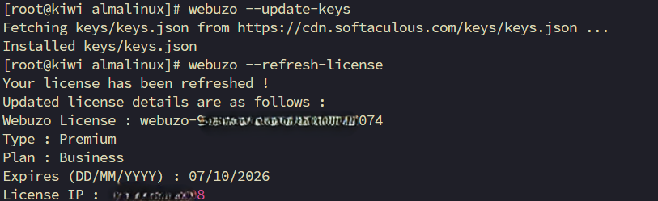

# Fix Webuzo License Showing Expired Despite a Valid License

Sometimes, Webuzo may show a license expiration issue even though you have a valid license key.

After logging in to the Webuzo Admin Panel, you may see a page asking you to enter your license key and email address. Even after submitting the correct information, the license may not activate.



You can check the current license status using:

```bash
webuzo -l
```

You may find that Webuzo reports the license as expired.



You may then try refreshing the license using:

```bash
webuzo --refresh-license
```

However, in some cases, this does not resolve the issue.



## Solution

### Step 1: Update the Webuzo Keys

Run the following command:

```bash
webuzo --update-keys
```

This will fetch and update the required keys from the Softaculous servers.


### Step 2: Refresh the Webuzo License

After updating the keys, refresh the license again:

```bash
webuzo --refresh-license
```



Now refresh the **Webuzo Admin Panel** in your web browser. The license should be active again.

## Special Thanks

Special thanks to **Mohammad Al Amin** from <a href="https://limda.net/" target="_blank" rel="noopener noreferrer">Limda Host</a> for helping us resolve this issue.
