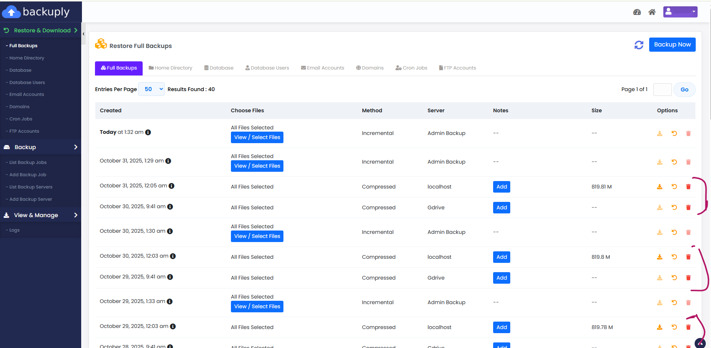
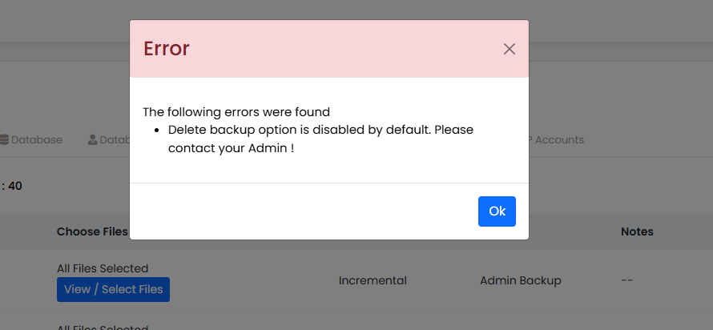

# Allow Webuzo Users to Delete Backuply Backup Files

The end user may take a backup in the Webuzo panel, but is unable to delete the file. In this case, the following solution will work. 




When the user tries to delete his/her backup, he/she gets the following error.




Run the following command to allow delete permission to the user for his/her backup.

```bash
backuply --enable-delete-backups
```

This will enable the delete option for Backuply in the end user panel.

> By default, the backup file deletion for the end user is restricted. 
